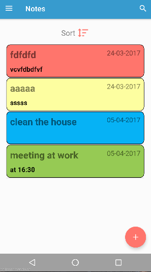
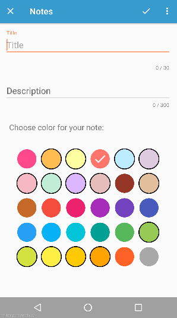
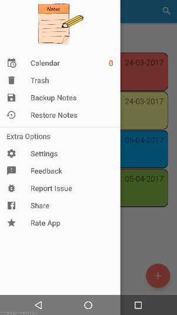

# Notes

[](http://www.gnu.org/licenses/gpl-3.0)

### A **notes** app for **Android** :notebook_with_decorative_cover:

 &nbsp;&nbsp;&nbsp;&nbsp;&nbsp;&nbsp;&nbsp;&nbsp;&nbsp;&nbsp;&nbsp;&nbsp;&nbsp;&nbsp;&nbsp;



###### :smile: &nbsp; With this app you can:
 * Easily manage and organize your notes
 * Add color to your notes for easy categorization
 * Add reminders to every note
 * Pin the notes widget to homescreen


### Build Notes from source

to build notes you have to:

```javascript

clone https://github.com/JohnKal/Notes.git
cd Notes
./gradlew build
```

### License

**Notes Android App Copyright (c) 2017 John Kalimeris.**

This program is free and open source: you can redistribute it and/or modify it under the terms of the
GNU General Public License as published by the Free Software Foundation,
either version 3 of the License, or (at your option) any later version.

[LICENSE](LICENSE) &nbsp;&nbsp; []()


